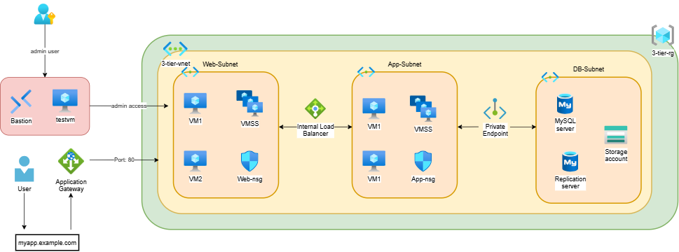

**# 🚀 Azure 3-Tier Architecture**
<h1 align="center" style="font-size: 50px;">🚀 Azure 3-Tier Architecture</h1>

This project demonstrates a \*\*traditional 3-tier architecture deployed in Microsoft Azure\*\* using Virtual Machines, Load Balancer, and Private Endpoint.

\---

**## 📌 Architecture Overview**

A 3-tier architecture divides the application into three layers:

The goal was to build a system where each layer is decoupled and secured.

**Web Tier**: An Azure Application Gateway serves as the entry point, routing traffic to a Virtual Machine Scale Set (VMSS).

**App Tier**: An Internal Load Balancer manages traffic between the Web and App layers, keeping the business logic private.

**Data Tier**: An Azure Database for MySQL configured with a Private Endpoint, ensuring the database is never exposed to the public internet.

This design improves \*\*scalability, security, and maintainability\*\*.

**## 🏗️ Architecture**

!\[Architecture Diagram]

\---

**## 🏗️ Architecture Flow**

User → Application Gateway (WAF) → Load Balancer → Web Tier → App Tier → Database Tier (Private Endpoint)

\---

**## ☁️ Azure Services Used**

\- Azure Virtual Network (VNet)

\- Network Security Groups (NSG)

\- Azure Application Gateway (WAF)

\- Azure Load Balancer (Public \& Internal)

\- Virtual Machines (Web \& App Tier)

\- Azure Bastion (Secure Access)

\- Azure SQL / MySQL (Database Tier)

\- Private Endpoint

\- Azure Storage Account

\---

**## 🧱 Architecture Components**

**### 🔹 Web Tier**

\- Hosted on Virtual Machines

\- Handles user requests

\- Connected to Public Load Balancer

**### 🔹 App Tier**

\- Processes business logic

\- Connected via Internal Load Balancer

**### 🔹 Database Tier**

\- Stores application data

\- Secured using Private Endpoint

\---

**## 🔐 Security Features**

\- NSG rules applied on all subnets

\- Private Endpoint for DB access

\- Azure Bastion for secure VM login

\- No direct internet access to backend tiers

\---

**## 📂 Project Structure**

Azure-3-Tier-Architecture

├── README.md

└── 3-tier-screenshots

\---

**## 📸 Output**

!\[Output-image](Azure-3-Tier-Architecture/3-tier-screenshots/output-image.png)

\---

**## 📸 Screenshots**

All deployment screenshots are available inside:

