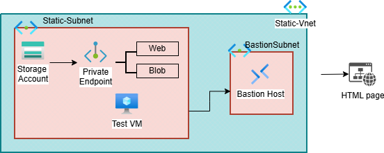

\# 🚀 **Azure Private Static Website Hosting**


\## 📌 **Overview**


This project demonstrates how to host a \*\*static website in Azure Storage\*\* and make it accessible \*\*only through a private network using Private Endpoints\*\*.


Unlike typical public static websites, this setup ensures \*\*secure, internal-only access\*\* — a common enterprise requirement.


\---


\## 🧠 **Real-World Analogy**


Think of this like a \*\*gated community website\*\*:


\* Public website → Anyone can access

\* Private website → Only authorized users inside the network can access


\---


\## 🏗️ **Architecture**


![Architecture]


\### 🔐 **Access Flow**


VM (Private Network) → Private DNS → Private Endpoint (web) → Storage Account


\### 📤 **Upload Flow**


VM → Private Endpoint (blob) → Storage Account ($web container)


\---


\## 🔧 **Azure Services Used**


\* Azure Storage Account (Static Website)

\* Azure Private Endpoint (web \& blob)

\* Azure Private DNS Zone

\* Azure Virtual Network

\* Azure Bastion

\* Virtual Machine (Windows/Linux)


\---


\## ⚙️ **Implementation Steps**


\### **1. Storage Setup**


\* Created Storage Account

\* Enabled Static Website

\* Uploaded initial `index.html


`


\### **2. Secure the Website**


\* Disabled public access

\* Created Private Endpoint (web)


\### **3. Configure DNS**


\* Created private DNS zone:

&#x20; `privatelink.web.core.windows.net`

\* Added A record mapping to private IP


\### **4. Private Access Setup**


\* Created VM inside VNet

\* Connected using Azure Bastion


\### **5. Upload from Private VM**


\* Created Private Endpoint (blob)

\* Uploaded file using Azure CLI:


```

*az storage blob upload --account-name <storage-name> --container-name '$web' --name index.html --file <path> --auth-mode login --overwrite*

```


\---


\## 🧪 **Validation**


\* `nslookup` resolves to private IP (10.x.x.x)

\* Website accessible only inside VM

\* Public access blocked


\---


\## 🚨 Challenges Faced


\* Incorrect Private Endpoint (blob vs web)

\* DNS resolution issues (NXDOMAIN)

\* Bastion connection issues (NSG rules)

\* Upload failures (authentication and networking)


\---


\## 🎯 **Key Learnings**


\* Static websites are public by default

\* Private Endpoint requires correct subresource (web)

\* DNS configuration is critical

\* Upload and access use different endpoints

\* Networking mistakes can break connectivity


\---


\## 🚀 **Outcome**


\* Website hosted securely in Azure

\* No public exposure

\* Accessible only via private network

\* Real-world enterprise architecture implemented

