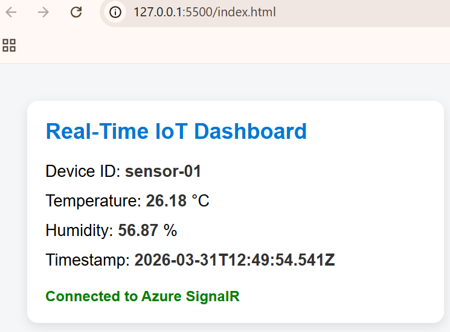

<h1 style="font-size: 50px;">🚀 **Azure Serverless Real-Time IoT Dashboard**</h1>

📌 **Introduction**

In modern cloud applications, real-time data processing is a critical requirement, especially in IoT systems, monitoring platforms, and live analytics dashboards. The challenge is not just ingesting data, but processing and delivering it to users instantly without delays.

This project demonstrates how to build a serverless, event-driven real-time data pipeline using Azure services. It simulates IoT data (temperature and humidity) and streams it live to a web dashboard using Azure Event Hub, Azure Functions, and Azure SignalR Service.

The entire system is designed to be scalable, low-latency, and infrastructure-free, leveraging Azure’s serverless capabilities.

\---

🏗️ **Architecture Overview**

!\[Architecture]

\---

⚙️ **Azure Services Used**

&#x20;🔹 **Azure Event Hub**

* Used for ingesting high-throughput streaming data
* Handles large volumes of events from multiple sources
* Acts as the central entry point for IoT data

Simple: “Data entry gate for streaming data”

\---

🔹 **Azure Function (Event Hub Trigger)**

* Serverless compute service that runs automatically when events arrive
* Processes incoming messages from Event Hub
* Sends processed data to SignalR

Simple: “Logic that runs automatically when data arrives”

\---

🔹 **Azure SignalR Service**

* Enables real-time communication between server and client
* Pushes updates directly to the browser without polling

Simple: “Live broadcaster for your application”

\---

🔹 **Azure Storage Account**

* Required by Azure Functions runtime
* Stores logs, state, and Event Hub checkpoints
* Ensures reliable message processing

Simple: “Memory and state manager for Functions”

\---

🔹 **Frontend (HTML + JavaScript)**

* Simple UI dashboard to display live data
* Uses SignalR client to receive updates

\---

🔁 **End-to-End Data Flow**

*1. A Node.js simulator generates IoT data every few seconds*  

*2. Data is sent to Azure Event Hub*  

*3. Azure Function (Event Hub Trigger) processes the incoming data*  

*4. Function pushes data to Azure SignalR Service*  

*5. SignalR sends data to connected browser clients*  

*6. Browser updates UI instantly without page refresh*  

\---

🧪 **Sample Data**

{

&#x20; "deviceId": "sensor-01",

&#x20; "temperature": 27.5,

&#x20; "humidity": 60,

&#x20; "timestamp": "2026-03-31T12:00:00Z"

}

!\[Temperature output]

**How to Run the Project**

1️⃣ **Clone Repository**

*git clone https://github.com/Ramya-S-M/Azure-Projects/azure-realtime-iot-dashboard.git*

*cd azure-realtime-iot-dashboard*

2️⃣ **Install Dependencies**

npm install

3️⃣ **Configure Environment Variables**

Create a .env file:

EVENT\_HUB\_CONNECTION\_STRING=your\_event\_hub\_connection\_string

EVENT\_HUB\_NAME=your\_event\_hub\_name

4️⃣ **Run IoT Simulator**

node send-data.js

You should see:

Sent: { deviceId: 'sensor-01', temperature: ..., humidity: ... }

5️⃣ **Run Frontend Dashboard**

Open index.html using Live Server:

*http://127.0.0.1:5500/index.html*

